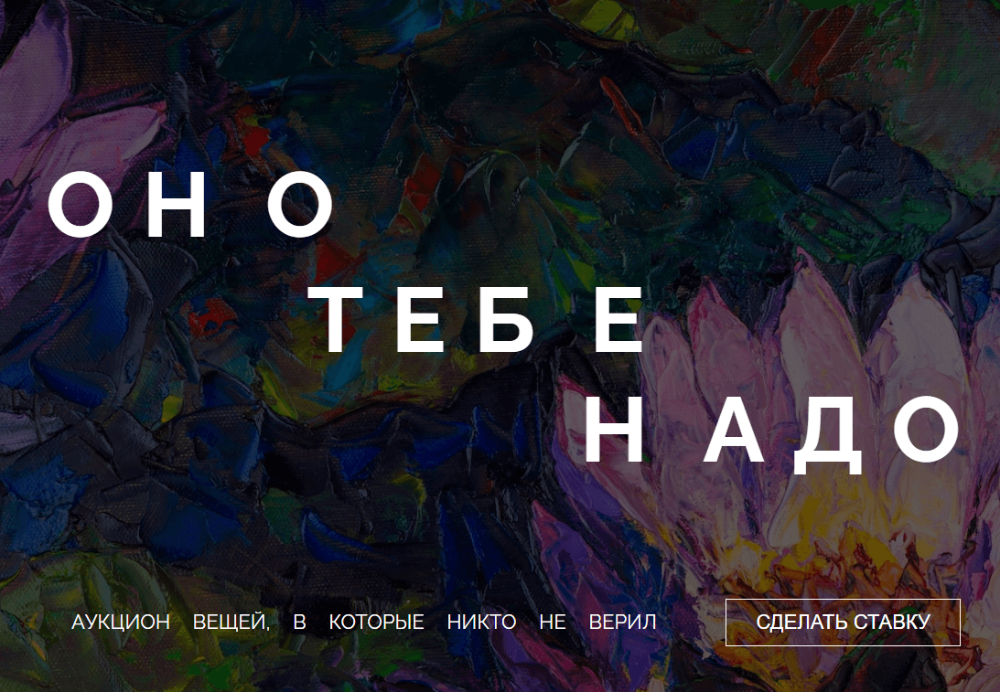
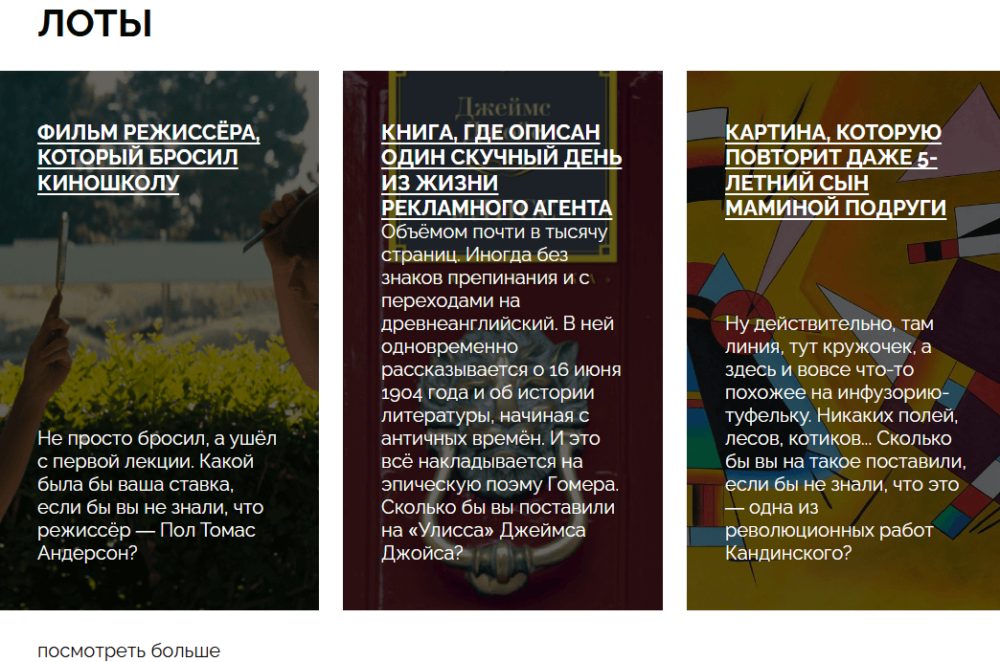
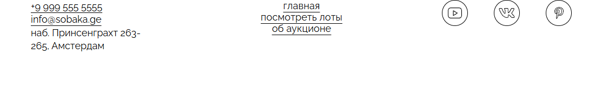

## Оно тебе надо — Аукционный сайт


*Главная страница сайта с обложным блоком*

### Описание проекта

Веб-сайт аукциона необычных предметов, где представлены лоты, в которые когда-то никто не верил. Проект демонстрирует навыки вёрстки сложных макетов с использованием современных CSS-технологий.

### Цель проекта

Создание адаптивного одностраничного сайта с использованием семантической вёрстки, CSS-гридов, флексбоксов и современных техник стилизации. Проект направлен на закрепление навыков работы с макетами.

### Технологии и инструменты

| Категория | Инструменты |
|-----------|-------------|
| HTML | Семантическая разметка, семантические теги |
| CSS | Flexbox, Grid Layout, CSS-анимации |
| Шрифты | Raleway (Bold, Regular) |
| Изображения | SVG-иконки, фоновые изображения |
| Дополнительно | Адаптивная вёрстка, оверлеи, кастомные стили |

### Функциональность

1. **Адаптивный дизайн** с корректной работой на различных устройствах
2. **Интерактивная обложка** с полупрозрачным оверлеем
3. **Карточки лотов** с изображениями и описаниями
4. **Навигационное меню** с активными состояниями
5. **Футер** с контактной информацией и социальными ссылками

### Как запустить проект локально

```bash
# Клонируйте репозиторий
git clone [ссылка на репозиторий]

# Перейдите в папку проекта
cd оно-тебе-надо

# Откройте проект в браузере через index.html
```

### Дополнительные скриншоты


*Демонстрация секции с карточками лотов и их интерактивными элементами*


*Нижняя часть сайта с контактной информацией и социальными ссылками*